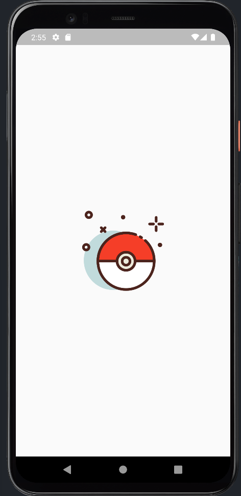
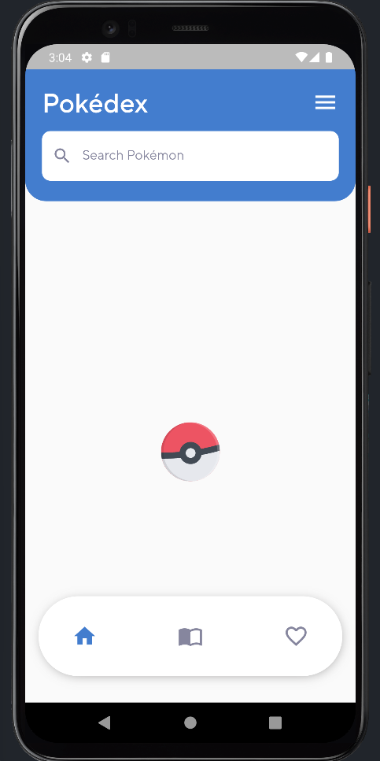
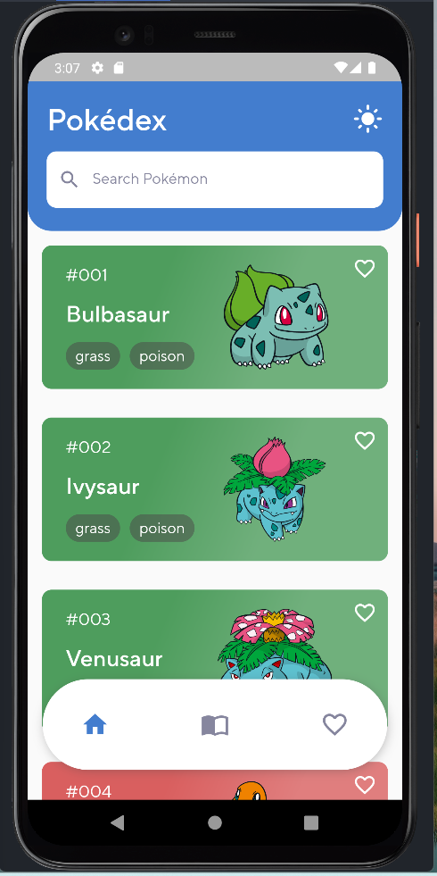

# pokedex

Flutter project pokedex.

## Getting Started

Para atualização de versão do Dart e Flutter projeto utiliza FVM.

Para organizar o projeto as Views estão lib/src/base/views.

Usuário neste projeto poderá visualizar os pokemons, fazer pesquisa, visualizar Stats e salvar seus
pokemons favoritos.

O projeto contempla:

Splash view com animação.

Lottie para animação de loading.

Navegação entre telas utilizei flutter_modular.

Atualizações futuras controle do tema ligth/dark com um clique no header.